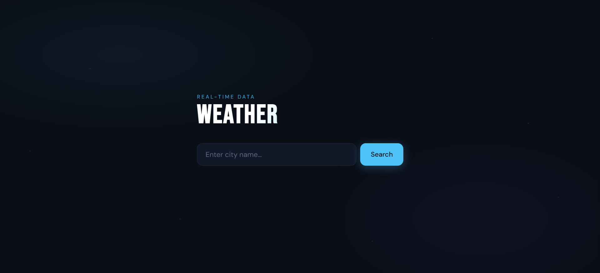
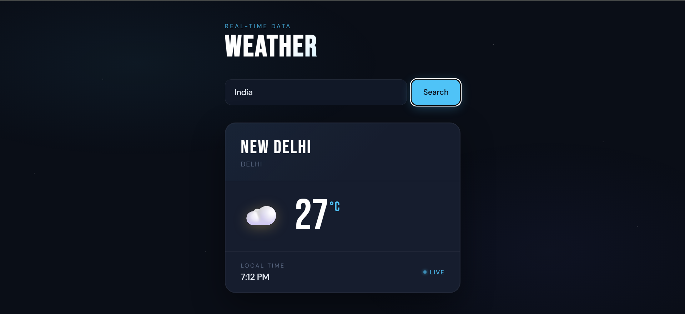
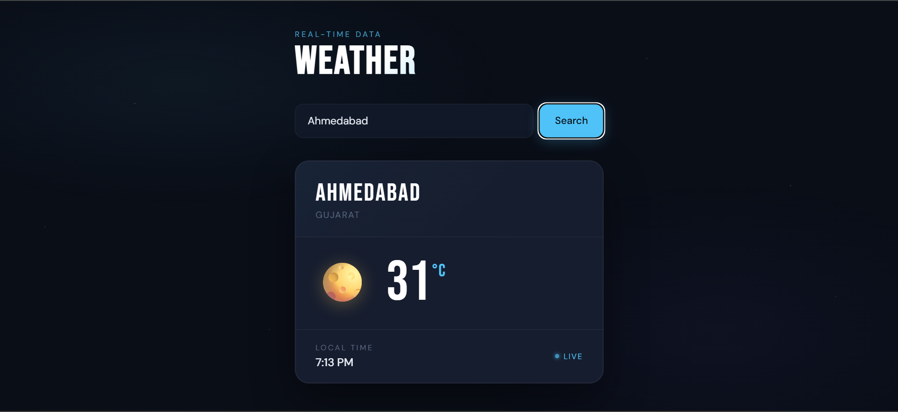

# 🌤️ Weather App

A modern **Weather Application** built using **HTML, CSS, and JavaScript** that provides real-time weather data for any city.

---

## 🚀 Features

* 🔍 Search weather by city name
* 🌡️ Real-time temperature display
* 📍 Location details (city & region)
* ⏰ Local time display
* 🌤️ Dynamic weather icons
* ⚡ Fast and responsive UI

---

## 🛠️ Tech Stack

* HTML5
* CSS3
* JavaScript (Vanilla JS)
* Weather API (Real-time data)

---

## 📂 Project Structure

```
📁 weather-app
 ├── asset/
 │    ├── landing-page.png
 │    ├── search-result-one.png
 │    └── search-result-two.png
 ├── index.html
 ├── style.css
 ├── script.js
 └── README.md
```

---

## 📸 Screenshots

### 🖥️ Landing Page



---

### 🔍 Search Result (Example 1)



---

### 🌡️ Search Result (Example 2)



---

## ⚙️ How to Run

1. Clone the repository

```
git clone https://github.com/dev-naresh608/weather-app.git
```

2. Open `index.html` in your browser

---

## 📌 Future Improvements

* 📱 Mobile optimization
* 📊 7-day weather forecast
* 🌎 Auto-detect user location
* 🌙 Dark/Light mode toggle

---

## 🙌 Author

**Naresh Chaudhary**

---

## ⭐ If you like this project

Give it a star ⭐ on GitHub
